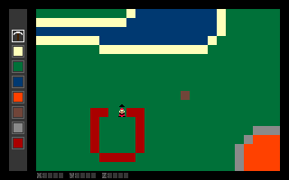

## Lerning old C version

**Idea:**
C MS-DOS simple sandbox game

Player can move over limited procedure generated world

x limit - 256
y limit - 256
z limit 64

Water level on z = 48
Water bottom in 32
Lava level on z = 8
Lava bottom at 2

Procedure generation works only from 32 to 48

In game there is 8 type of blocks
0. AIR
1. SAND
2. GRASS
3. WATER
4. LAVA
5. MUD
6. STONE
7. BRICK

Player can move over x, y and z. Player can't move over water or lava
Player can move one block over z if z+/-1 == 0 and z+/-2 != 0
If at players x, y: z-1 == 0 and z-2 == 0 players fall over z while z-2 != 0
Player can set any block

Controls:
ARROWS - move
WASD - set build direction over xy
ZX - set build direction ove z
SPACE - place active block
12 - scroll over active block

Visible world part - 27:18 block. When player pass over current visible part game load next world part. 

Place rules:
Near 0 can be placed only 0 if z > 48
Near 0 can be placed 6
Near 1 can be placed 3, 2, 5
Near 2 can be placed 1, 6
Near 3 can be placed 3, 1, 6
Near 4 can be placed 4, 6
Near 5 can be placed 6, 2
Near 6 can be placed 3, 4

